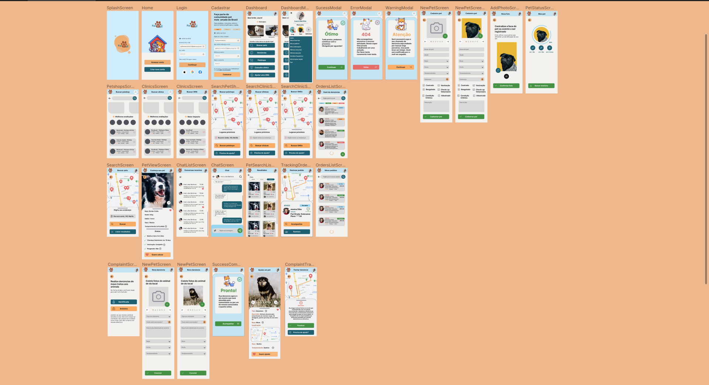

# FarejoPet - Aplicativo para Adoção e Resgate de Animais em Situação de Vulnerabilidade

Este repositório contém informações e recursos relacionadas ao projeto do TCC "Aplicativo para Adoção e Resgate de Animais em Situação de Vulnerabilidade", desenvolvido por Guilherme S. Martins e Veronica Gonçalves como trabalho de conclusão do curso de Análise e Desenvolvimento de Sistemas na Faculdade de Tecnologia de Garça, no primeiro semestre de 2023.

## Resumo

Por anos, os animais têm sido considerados membros da família, no entanto, é de conhecimento público que muitos deles enfrentam situações de abandono e vulnerabilidade, representando uma desconexão preocupante entre os humanos e os animais pelos quais são responsáveis. Isso não é apenas um problema moral, mas também econômico. Diante dessa realidade, foi desenvolvido o aplicativo FarejoPet, com o propósito de fazer a diferença e contribuir para a solução dessa problemática.

## Funcionalidades Principais

- **Adoção e Resgate:** Oferece uma plataforma para adoção e resgate de animais em situação de vulnerabilidade.
- **Conexão entre Usuários e Instituições:** Facilita a comunicação entre usuários interessados em adotar ou resgatar animais e instituições de cuidado animal.
- **Interface Intuitiva e Amigável (amigável para pessoas com espectro autista):** Desenvolvida com foco na usabilidade, proporcionando uma experiência agradável para os usuários.
- **Doações para ONGs com retorno de feedback mensal transparente para os doadores:** A aplicação conta com módulo de doação para ONGs relacionadas que estejam em nossa base dados e que forneçam feedback transparente e periódico sobre o projeto.
- **Módulos de e-commerce para comercializar produtos para petshops e serviços de clínicas veterinárias** A aplicação conta com módulo de e-commerce para que as empresas associdadas em nossa base possam comercializar seus produtos. A proposta inicial seria de 70% do lucro líquido seria doado para Ongs associadas e homologadas.

## Motivação do Projeto

A motivação por trás do FarejoPet surge da preocupação com a crescente situação de abandono e vulnerabilidade enfrentada por animais de estimação. Observando a falta de plataformas eficazes para conectar pessoas dispostas a ajudar esses animais e as instituições responsáveis por seu cuidado, percebemos a necessidade de uma solução tecnológica que pudesse facilitar esse processo.

O FarejoPet busca preencher essa lacuna, fornecendo uma plataforma centralizada onde os usuários podem encontrar informações sobre animais disponíveis para adoção ou resgate, além de estabelecer um canal direto de comunicação com as instituições, promovendo a conscientização e a ação em prol do bem-estar animal e social.

## Palavras-Chave

JavaScript, Aplicação Mobile, Animais de Estimação, Petshops, Interface de Aplicação, Modelagem de Dados, Banco de Dados, Engenharia de Software, Linguagem de Modelagem Unificada (UML).

## Documentação oficial do projeto:

[Documentação oficial completa do TCC (Final Paper)](https://drive.google.com/file/d/1cly7pu_z8f6nZY4OkhKfEnHHrnSiM4np/view?usp=drive_link) 

## Mapa mental e regras de negócio

## Metodologia de Desenvolvimento e Pesquisa

#### Motivações para escolher SCRUM com Kanban como metodologia com entregas iterativas:

O Scrum é um framework ágil utilizado para gerenciamento e desenvolvimento de projetos, especialmente na área de software. Ele se baseia em iterações curtas chamadas sprints, enfatizando a colaboração da equipe, a adaptabilidade às mudanças e a entrega contínua de valor ao nosso público alvo. Decidimos adicionar o Scrum a este projeto porque oferece flexibilidade, promove a comunicação eficaz entre os membros da equipe e permite uma abordagem incremental, o que é essencial para lidar com requisitos em constante evolução e garantir entregas frequentes e de alta qualidade.

### Cronograma de Sprints utilizando SCRUM (Time boxes de 7 dias) 
| Sprint | Data inicial | Data final | Período (dias) | Ações |
|--------|--------------|------------|----------------|-------|
| 1      | 05/12/2022   | 12/12/2022 | 7              | - Definição de método de trabalho - Pesquisa de validação - Apuração de pesquisa - Criar todos os repositórios - Criar quadro no Trello |
| 2      | 12/12/2022   | 19/12/2022 | 7              | - Melhorar nossa documentação com NOTION - Criar um grupo para comunicação direta |
| 3      | 19/12/2022   | 26/12/2022 | 7              | - Terminar a logo do projeto - Terminar tipografia - Criar apresentação para a qualificação |
| 4      | 26/12/2022   | 02/01/2023 | 7              | - Finalizar diagramação - Começar o protótipo de baixa fidelidade |
| 5      | 02/01/2023   | 09/01/2023 | 7              | - Começar a realizar o protótipo de baixa fidelidade |
| 6      | 09/01/2023   | 16/01/2023 | 7              | - Revisão da documentação - Adição de referência |
| 7      | 16/01/2023   | 23/01/2023 | 7              | - Organização de paleta de cores - Revisão de protótipo no FIGMA - Organização do plano de negócios |
| 8      | 23/01/2023   | 30/01/2023 | 7              | - Revisão de diagramas - Modelagem de logotipo |
| 9      | 30/01/2023   | 06/02/2023 | 7              | - Prototipação via clique - Padronização de layout |
| 10     | 06/02/2023   | 13/02/2023 | 7              | - Design e integração de API |
| 11     | 13/02/2023   | 20/02/2023 | 7              | - Integração com banco de dados POSTGRESQL - Adição de ORM |
| 12     | 20/02/2023   | 27/02/2023 | 7              | - Adição de tratativa de erros ao projeto (API) - Incremento de documentação - Revisão de containers Docker |
| 13     | 27/02/2023   | 06/03/2023 | 7              | - Adição de diagramas e fluxos na documentação |
| 14     | 06/03/2023   | 13/03/2023 | 7              | - Implementação de novas rotas na API |
| 15     | 13/03/2023   | 20/03/2023 | 7              | - Criação de novas telas para MVP no aplicativo mobile |
| 16     | 20/03/2023   | 27/03/2023 | 7              | - Adição de fluxos menores API |
| 17     | 27/03/2023   | 03/04/2023 | 7              | - Revisão de telas mobile |
| 18     | 03/04/2023   | 10/04/2023 | 7              | - Restruturação mobile |
| 19     | 10/04/2023   | 17/04/2023 | 7              | - Testes gerais |
| 20     | 17/04/2023   | 24/04/2023 | 7              | - Teste de consumo de API |
| 21     | 24/04/2023   | 01/05/2023 | 7              | - Revisão geral por parte dos integrantes |
| 22     | 01/05/2023   | 08/05/2023 | 7              | - Adicione itens |
| 23     | 08/05/2023   | 15/05/2023 | 7              | - Revisão geral e entrega da documentação final |
| 24     | 15/05/2023   | 22/05/2023 | 7              | - Prazo para alinhamento com corpo da documentação |
| 25     | 22/05/2023   | 29/05/2023 | 7              | - Revisão geral para defesa |

## Diagramação UML do projeto
### Diagrama UML de Caso de Uso

### Diagrama UML de Classes

## Protótipo no Figma

[Link direto para o protótipo no Figma](https://www.figma.com/file/7kLfqZ91L9fZMJLsfOctAu/Farejopet---Mocks?type=design&node-id=0%3A1&mode=design&t=ahskI0Bslh9Qi1Cu-1) 

### Preview

## Como contribuir e revisar esta documentação

Se você deseja contribuir com este projeto, siga estes passos:
1. Faça um fork deste repositório.
2. Crie uma nova branch (`git checkout -b feature/nova-feature`).
3. Faça commit das suas alterações (`git commit -am 'Adiciona nova feature'`).
4. Faça push para a branch (`git push origin feature/nova-feature`).
5. Abra um Pull Request.

## Autores

- [Guilherme dos Santos Martins](https://github.com/g-santosmartins/)
    - [LinkedIn](https://www.linkedin.com/in/guilhermedossantosmartins/)
    - [Linktree](https://linktr.ee/gsantosmartins)
- [Veronica Gonçalves](https://github.com/ve-panda) 
  - [LinkedIn](https://www.linkedin.com/in/ver%C3%B4nica-gon%C3%A7alves-ab509b239/) 

## Agradecimentos especiais

Gostaríamos de agradecer aos nossos familiares amigos e todos que de forma direta ou indireta nos forneceram apoio nesta jornada em especial: a Faculdade de Técnologia de Garça pelo excelente curso de nível superior e claro a todos os funcionários, em especial alguns docentes que fizeram uma diferença imensurável em nossas vidas:

### Nosso professor orientador:

Prof. Me. Luiz Carlos Querino Filho

[Currículo Lattes](http://lattes.cnpq.br/5528785342233724)

### Docentes:

Larissa Pavarini da Luz 

[Currículo Lattes](http://lattes.cnpq.br/3087395778438064)

Prof. Ma. Renata Aparecida de Carvalho Paschoal

[Currículo Lattes](http://lattes.cnpq.br/9750500654339767)

Prof. Ma. Leysiane Cristina Pavani Pazini 

[Currículo Lattes](http://lattes.cnpq.br/1419975657681241)

Prof. Me. Maurício Duarte

[Currículo Lattes](http://lattes.cnpq.br/7265559606596355)

Prof. Espec. Danilo Dolci

[Currículo Lattes](http://lattes.cnpq.br/1419975657681241)

Prof. Me. Cristian Ricardo de Andrade

[Currículo Lattes](http://lattes.cnpq.br/1507940250282236)

## Licença

Esta documentação está sob a [licença MIT](./LICENSE)

